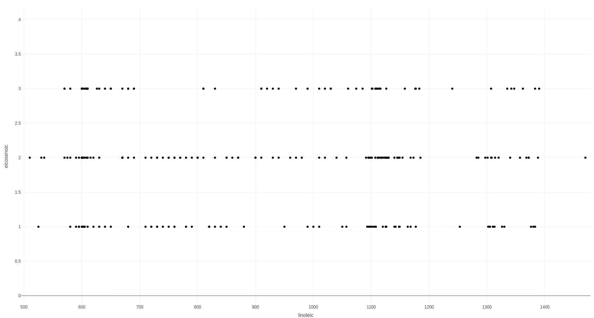
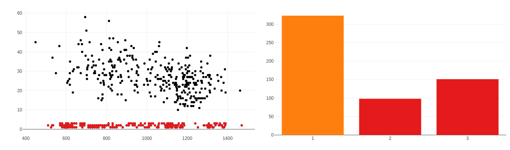
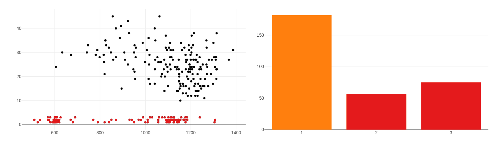
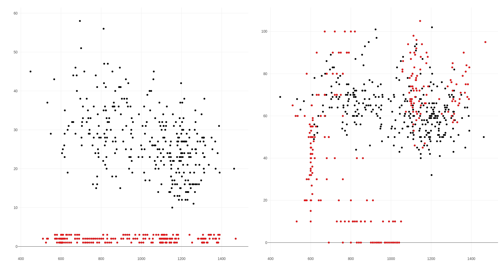
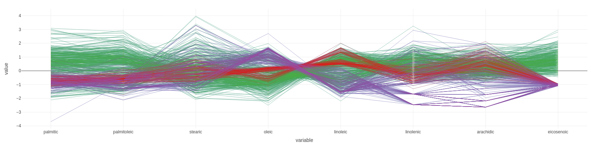
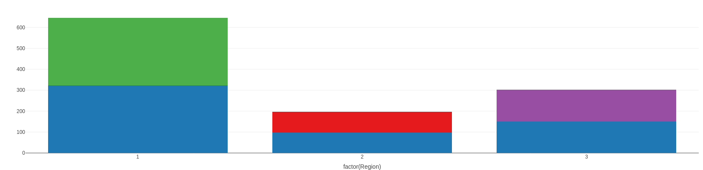
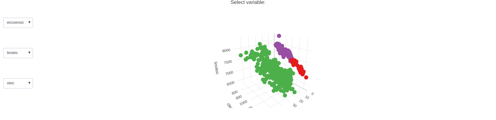

```{r setup, include=FALSE}
knitr::opts_chunk$set(echo = TRUE)
```
This report is submitted by Greeshma Jeev Koothuparambil and Olayemi Morrison as a part of Laboratory 6 of Visualization (732A98) Course for the 2023 Autumn Semester.

>Assignment 1
  
Following are the libraries used for the successful completion of this assignment:  
tidytext  
dplyr  
tidyr  
readr  
textdata  
wordcloud  
RColorBrewer  
plotly  
ggplot2  
visNetwork  

Here is how we loaded our libraries:  

```{r message=FALSE, warning=FALSE}
library(tidytext)
library(dplyr)
library(tidyr)
library(readr)
library(textdata)
library(wordcloud)
library(RColorBrewer)
library(plotly)
library(ggplot2)
library(visNetwork)
```
***
#### Reading the the file Five.txt and OneTwo.txt  

```{r message=FALSE, warning=FALSE}
#Read the file
text5=read_lines("Five.txt")
text12 = read_lines("OneTwo.txt")

```

***


**1. Visualize word clouds corresponding to Five.txt and OneTwo.txt and make sure that stop words are removed. Which words are mentioned most often?**  

```{r message=FALSE, warning=FALSE}
## first plot

#color pallette
pal <- brewer.pal(8,"Dark2")

## Working on Five data
textFrame5=tibble(text=text5)%>%mutate(line = row_number())
#one-token-per-row
tidy_frame5=textFrame5%>%unnest_tokens(word, text)
#removing stopwords
tidy_frame51=tidy_frame5%>%anti_join(stop_words, by="word")
#count word
tidy_framecount5=tidy_frame51%>%count(word, sort=TRUE)

## Working on one two data
textFrame12=tibble(text=text12)%>%mutate(line = row_number())
#one-token-per-row
tidy_frame12=textFrame12%>%unnest_tokens(word, text)
#removing stopwords
tidy_frame121=tidy_frame12%>%anti_join(stop_words, by="word")
#count word
tidy_framecount12=tidy_frame121%>%count(word, sort=TRUE)


```
  
The word cloud for Five.txt looks like this:  
  
```{r message=FALSE, warning=FALSE, echo=FALSE}
#wordcloud 5
tidy_framecount5%>%
  with(wordcloud(word, n, max.words = 100, colors=pal, random.order=F))

```
  
The word cloud for OneTwo.txt looks like this:  
  
```{r message=FALSE, warning=FALSE, echo=FALSE}
#wordcloud 12
tidy_framecount12%>%
  with(wordcloud(word, n, max.words = 100, colors=pal, random.order=F))

```

##### Analysis  
_In the world cloud of data five it is the word watch which is mentioned the most followed by time, casio, price, watches, band, digital and nice. The word cloud of data onetwo as well show watch as the most repeated word followed by time and casio._  

  
***
  
**2. Without filtering stop words, compute TF-IDF values for OneTwo.txt by aggregating each 10 lines into a separate “document”. Afterwards, compute mean TF-IDF values for each word over all documents and visualize them by the word cloud. Compare the plot with the corresponding plot from step 1. What do you think the reason is behind word “watch” being not emphasized in TF-IDF diagram while it is emphasized in the previous word clouds?**  

```{r message=FALSE, warning=FALSE}
# second plot

#tf-idf, treating 10 lines as separate document
tidy_frame12tfidf=textFrame12%>%unnest_tokens(word, text)%>%
  mutate(line1=floor(line/10))%>%
  count(line1,word, sort=TRUE)

TFIDF12=tidy_frame12tfidf%>%bind_tf_idf(word, line1, n)
tfidfmean12 <- TFIDF12%>% group_by(word) %>% summarise(tfidfmean = mean(tf_idf))


```
  
The word cloud with tfidf mean look like this:  

```{r message=FALSE, warning=FALSE, echo=FALSE}
#wordcloud TFIDF12
tfidfmean12 %>%  with(wordcloud(word, tfidfmean, max.words = 100, colors=pal, random.order=F,scale = c(2, 0.5)))

```
  
  
##### Analysis  
_We are using tfidf in the data processing which bring out the important words in the document. The plot says that according to tfidf algorithm words like bad, luminesence, shockingly and could are the most important words. These are followed by words like actual, loud, hour and perfect. The algorithm is emphasising on the importance of a word rather than its number of occurrences. This is why the word watch is losing its priority in the plot._  


  
***
  
**3. Aggregate data in chunks of 5 lines and compute sentiment values (by using “afinn” database) for respective chunks in Five.txt and for OneTwo.txt . Produce plots visualizing aggregated sentiment values versus chunk index and make a comparative analysis between these plots. Does sentiment analysis show a connection of the corresponding documents to the kinds of reviews we expect to see in them?**  

```{r message=FALSE, warning=FALSE}
# third plot

#sentiment, treating 5 lines as separate document

tidy_frame12senti=textFrame12%>%unnest_tokens(word, text)%>%
  left_join(get_sentiments("afinn"))%>%
  mutate(line1=floor(line/5))%>%
  group_by(line1, sort=TRUE)%>%
  summarize(Sentiment=sum(value, na.rm = T))

p1 <- plot_ly(tidy_frame12senti, x=~line1, y=~Sentiment)%>%add_bars()


tidy_frame5senti=textFrame5%>%unnest_tokens(word, text)%>%
  left_join(get_sentiments("afinn"))%>%
  mutate(line1=floor(line/5))%>%
  group_by(line1, sort=TRUE)%>%
  summarize(Sentiment=sum(value, na.rm = T))

p2 <- plot_ly(tidy_frame5senti, x=~line1, y=~Sentiment)%>%add_bars()

```
  
The sentiment graph for Five.txt is as follows: 

```{r message=FALSE, warning=FALSE, echo=FALSE}
p2
```

The sentiment graph for OneTwo.txt is as follows: 

```{r message=FALSE, warning=FALSE, echo=FALSE}
p1
```  
  
##### Analysis  
_As for the plot for five data, the sentiment values range from 1 to 60. The graph clearly exposes the interest expressed in the data._  

_As for the plot for onetwo data, the sentiment values range from -22 to 29. The graph, unfortunately, does not add up to the real sentiment of the data. For most of the lines, the plot gives out a positive reaction even though most of the reviews are negative in nature. This could be because of the omission of words like caution, quit, replace, unfortunately and so forth._  


  
***
  
**4. Create the phrase nets for Five.Txt and One.Txt with connector words**  
**• am, is, are, was, were**  
**• at**  
**When you find an interesting connection between some words, use Word Trees https://www.jasondavies.com/wordtree/ to understand the context better. Note that this link might not work properly in Microsoft Edge (if you are using Windows 10) so use other browsers.**  

```{r message=FALSE, warning=FALSE}
# Fourth plot

phraseNet=function(text, connectors){
  textFrame=tibble(text=paste(text, collapse=" "))
  tidy_frame3=textFrame%>%unnest_tokens(word, text, token="ngrams", n=3)
  tidy_frame3
  tidy_frame_sep=tidy_frame3%>%separate(word, c("word1", "word2", "word3"), sep=" ")
  
  #SELECT SEPARATION WORDS HERE: now "is"/"are"
  tidy_frame_filtered=tidy_frame_sep%>%
    filter(word2 %in% connectors)%>%
    filter(!word1 %in% stop_words$word)%>%
    filter(!word3 %in% stop_words$word)
  tidy_frame_filtered
  
  edges=tidy_frame_filtered%>%count(word1,word3, sort = T)%>%
    rename(from=word1, to=word3, width=n)%>%
    mutate(arrows="to")
  
  right_words=edges%>%count(word=to, wt=width)
  left_words=edges%>%count(word=from, wt=width)
  
  #Computing node sizes and in/out degrees, colors.
  nodes=left_words%>%full_join(right_words, by="word")%>%
    replace_na(list(n.x=0, n.y=0))%>%
    mutate(n.total=n.x+n.y)%>%
    mutate(n.out=n.x-n.y)%>%
    mutate(id=word, color=brewer.pal(9, "Blues")[cut_interval(n.out,9)],  font.size=40)%>%
    rename(label=word, value=n.total)
  
  #FILTERING edges with no further connections - can be commented
  edges=edges%>%left_join(nodes, c("from"= "id"))%>%
    left_join(nodes, c("to"="id"))%>%
    filter(value.x>1|value.y>1)%>%select(from,to,width,arrows)
  
  nodes=nodes%>%filter(id %in% edges$from |id %in% edges$to )
  
  visNetwork(nodes,edges)
  
}

phrase5 <- phraseNet(text5, c("is", "are", "am", "was","were","at"))
phrase12 <- phraseNet(text12, c("is", "are", "am", "was","were","at"))


```
  
  
  
The resulting visNetwork for Five.txt is as follows:  
```{r message=FALSE, warning=FALSE, echo=FALSE}
phrase5
```

   
The resulting visNetwork for OneTwo.txt is as follows:  
```{r message=FALSE, warning=FALSE, echo=FALSE}
phrase12
```

  
  
##### Analysis  
_Most associated words are ‘watch’, ‘time’, ‘easy’ and ‘night’ according to the phrase net of data five.  The graph shows a connection between the nodes ‘time’ and ‘night’ as well. But when compared to the word tree created, it is noticeable that most of the associated words are missing in the word tree. For instance, the word tree algorithm is starting the tree with the word “this” as the root word. Therefore it misses on the a highly associated word ‘unbeatable’ since the sentence involving the word ‘unbeatable’ is “At $49 this watch is unbeatable” which does not start with the word ‘this’._   
[Word Tree for Five.txt](https://www.jasondavies.com/wordtree/?source=47fee0cc5ebb4795a60d5b37aaa2b907&prefix=this)  
_The phrase net of onetwo data says that most associated words are  watch, keeping, alarm, night and display. The word nodes  ‘watch’ and ‘alarm’ are associated with the word ‘defective’.  Although most of the phrase links make sense, some remain senseless.  For example, the word ‘watch’ is associated with the word ‘supposed’ which does not add any meaning to the analysis. The said sentence from the document  is as follows : “This watch was supposed to be great to my soccer game day but after I wear it for a week it doesn't work good enough.” same goes for the case of the link between ‘alarm’ and ‘practically’ where the sentence is “As time went by, it became unmanageable, and the alarm is practically unusable, the button for the chronometer, I think the electronic panel got a bit confused, you know, these watches sometimes get to be stored in a warehouse for months at a time, even over a year, so when you get it you think it's brand new, but maybe it's been stored for a year and half, God knows.” The word cloud seems a little bit harder to manage compared to phrase net, because the relationships formed  by words ‘at’ are harder to find in the wordtree. Also it is difficult to find relation nodes like the word ‘defective’ which connects ‘alarm,’ and ‘watch’._  
[Word Tree for OneTwo.txt](https://www.jasondavies.com/wordtree/?source=5ce8de91282018d925828284e3b9eca9)  

***

  
**5. Based on the graphs obtained in step 4, comment on the most interesting findings, like:**  
**• Which properties of this watch are mentioned mostly often?**  
_The most common discussion topics are performance of the watch, the time, display, alarm,ease of usage._  

  
**• What are satisfied customers talking about?**  
_The satisfied customers talks about the features of the watch, its durability, functionalities and the place they got the watch from_  
  
  
**• What are unsatisfied customers talking about?**  
_The unsatisfied customers talk about the display and alarm features  of the watch._  
  
  
**• What are properties of the watch mentioned by both groups?**  
_Both graphs talk about the watch, their display and the nighttime features._  
  
  
**• Can you understand watch characteristics (like size of display, features of the watches) by observing these graphs?**  
_Yes , we can understand about display, night time features, areas of defects and the feelings of customers about the watch._  
  
  
***
  
  
  
>Assignment 2

Following are the libraries used for the successful completion of this assignment:  
plotly  
crosstalk  
tidyr  
GGally  

Here is how we loaded our libraries:  

```{r message=FALSE, warning=FALSE}
library(plotly)
library(crosstalk)
library(tidyr)
library(GGally)
```
***

  
Reading the the file olive.csv in to the dataframe  

```{r message=FALSE, warning=FALSE}
olive <- read.csv("olive.csv")

o1 <- SharedData$new(olive)
```

**1. Create an interactive scatter plot of the eicosenoic against linoleic. You have probably found a group of observations having unusually low values of eicosenoic. Hover on these observations to find out the exact values of eicosenoic for these observations.** 

```{r message=FALSE, warning=FALSE}
#Question 2.1 - creating an interactive scatterplot
scatterOlive <- plot_ly(o1, x = ~linoleic, y = ~eicosenoic) %>%
  add_markers(color = I("black"))

```
The scatterplot looks like this:  
```{r message=FALSE, warning=FALSE, echo=FALSE}
scatterOlive

```
  
##### Analysis  
_While hovering on the observations with low values of eicosenoic, the exact values for these observations are identified to be 1, 2 or 3._
```{r}

```


***


**2. Link the scatterplot of (eicosenoic, linoleic) to a bar chart showing Region and a slider that allows to filter the data by the values of stearic. Use persistent brushing to identify the regions that correspond unusually low values of eicosenoic. Use the slider and describe what additional relationships in the data can be found by using it. Report which interaction operators were used in this step.**    

```{r message=FALSE, warning=FALSE}
#Question 2.2 - creating the linked bar graph
barOlive <-plot_ly(o1, x=~as.factor(Region))%>%add_histogram()%>%layout(barmode="overlay")


p01 <- bscols(widths=c(2, NA),filter_slider("STE", "Stearic", o1, ~stearic)
       ,subplot(scatterOlive,barOlive)%>%
         highlight(on="plotly_selected", dynamic=T, persistent = T, opacityDim = I(1))%>%hide_legend())

```
  
The linked bar graph  looks like this:  
  
```{r message=FALSE, warning=FALSE, echo=FALSE}
p01

```

##### Analysis  
_Through persistent brushing, the identified that data points with low values of eicosenoic primarily belong to regions 2 and 3._  
```{r}

``` 
_There are also observed changes in the distribution of the data as the slider is adjusted, causing some points to disappear and altering the y-axis values for both the scatter plot and the bar graph. This indicates that the filter is effective in hiding data points that do not meet the specified stearic criteria. On both the scatter plot and the bar graph, as the value of stearic is decreased on the slider, the range of values on the y-axis reduces. For instance, the initial y-axis range for the scatter plot was 0 to 60, but it changes to 0 to 40 as we move the slider leftward. Similarly, the bar graph's y-axis range decreases from 0 to 300 to 0 to 150. This implies that the filtered data subset has lower eicosenoic values._  

```{r}

``` 
_The selection operator was used to highlight and draw attention to data points that exhibited low y-values. This facilitated the identification of patterns or trends associated with regions 2 and 3, where the majority of low y-values were observed._  

_The connection operator was used to connect the scatter plot with the bar graph showing regions (1, 2, and 3), allowing us to simultaneously explore and understand relationships between variables. For instance, when selecting data points with low eicosenoic values in the scatter plot, the corresponding bars in the bar graph representing regions 2 and 3 were highlighted. This emphasizes the association of low eicosenoic values with specific regions, providing context._  

_The filtering provided the exploration of the dataset with a focus on specific stearic conditions. By adjusting the slider, the data is filtered to meet certain conditions, such as selecting data points where stearic was below a certain threshold. This dynamic filtering allows us observe how changes in stearic impact the distribution of data points on both the scatter plot and the bar graph's y-axis.._  

***
  
**3. Create linked scatter plots eicosenoic against linoleic and arachidic against linolenic. Which outliers in (arachidic, linolenic) are also outliers in (eicosenoic, linoleic)? Are outliers grouped in some way? Use brushing to demonstrate your findings.**  

```{r message=FALSE, warning=FALSE}
#Question 2.3 - Create linked scatter plots
scatterOlive2 <- plot_ly(o1, x = ~linoleic, y = ~arachidic) %>%
  add_markers(color = I("black"))

p02 <- subplot(scatterOlive,scatterOlive2)%>%
  highlight(on="plotly_selected", dynamic=T, persistent=T, opacityDim = I(1))%>%hide_legend()

```
  
Thelinked scatter plot is as follows:  

```{r message=FALSE, warning=FALSE, echo=FALSE}
p02

```
  
  
##### Analysis  
_Upon further observation of the two scatter plots with linoleic as the common factor, there is a discrepancy in the grouping of the outliers._  
_In Plot 1 (eicosenoc vs linoleic), a distinct cluster of data points with low values on the y-axis is easily identifiable. However, when we examine the corresponding data points on the y-axis in Plot 2, we do not observe a similar clustering pattern. Instead, the data points seem to be distributed throughout the plot, with only a small concentration of low values. This discrepancy may be attributed to the influence of additional variables such as geographical location, as we have a variable named Area on the original dataset. This or other factors could affect the distribution of data points on the second plot._  

```{r}

``` 

  
***
  
**4. Create a parallel coordinate plot for the available eight acids, a linked 3d-scatter plot in which variables are selected by three additional drop boxes and a linked bar chart showing Regions. Use persistent brushing to mark each region by a different color.Observe the parallel coordinate plot and state which three variables (let’s call them influential variables) seem to be mostly reasonable to pick up if one wants to differentiate between the regions. Does the parallel coordinate plot demonstrate that there are clusters among the observations that belong to the same Region? Select the three influential variables in the drop boxes and observe in the 3d-plot whether each Region corresponds to one cluster.**  

```{r message=FALSE, warning=FALSE}
#Question 2.4 - Parallel coords
p<-ggparcoord(olive, columns = c(4:11))

d<-plotly_data(ggplotly(p))%>%group_by(.ID)
d1<-SharedData$new(d, ~.ID, group="olive")
p1<-plot_ly(d1, x=~variable, y=~value)%>%
  add_lines(line=list(width=0.3))%>%
  add_markers(marker=list(size=0.3),
              text=~.ID, hoverinfo="text")


olive2=olive
olive2$.ID=1:nrow(olive)
d2<-SharedData$new(olive2, ~.ID, group="olive")
p2<-plot_ly(d2, x=~factor(Region) )%>%add_histogram()%>%layout(barmode="stack")


ButtonsX=list()
for (i in 4:11){
  ButtonsX[[i-3]]= list(method = "restyle",
                        args = list( "x", list(olive[[i]])),
                        label = colnames(olive)[i])
}

ButtonsY=list()
for (i in 4:11){
  ButtonsY[[i-3]]= list(method = "restyle",
                        args = list( "y", list(olive[[i]])),
                        label = colnames(olive)[i])
}

ButtonsZ=list()
for (i in 4:11){
  ButtonsZ[[i-3]]= list(method = "restyle",
                        args = list( "z", list(olive[[i]])),
                        label = colnames(olive)[i])
}

p3 <- plot_ly(d2,x=~stearic,y=~oleic,z=~linoleic)%>%add_markers() %>%
  layout(xaxis=list(title=" "), yaxis=list(title=" "), zaxis=list(title=" "),
         title = "Select variable:",
         updatemenus = list(
           list(y=0.9, buttons = ButtonsX),
           list(y=0.6, buttons = ButtonsY),
           list(y=0.3, buttons = ButtonsZ)
         )  )

ps<-htmltools::tagList(p1%>%
                         highlight(on="plotly_selected", dynamic=T, persistent = T, opacityDim = I(1))%>%
                         hide_legend(),
                       p2%>%
                         highlight(on="plotly_selected", dynamic=T, persistent = T, opacityDim = I(1))%>%
                         hide_legend(), 
                       p3%>%
                         highlight(on="plotly_selected", dynamic=T, persistent = T, opacityDim = I(1))%>%
                         hide_legend()
)
htmltools::browsable(ps)
```
  
The parallel cords plot is as shown  

  
  
##### Analysis  
_From the observation of the parallel coordinate plot, the most influential variables are highlighted below:_  

**Region 1 -** _eicosenoic is clearly the influential variable, as we can easily identify the region through this variable._   

**Region 2 -** _oleic is the influential variable for identifying this region_  

**Region 3 -** _linoelic is the influential variable here, although it is noted that eicosenoic is also able to identify this region._ 

```{r}

``` 

_Within the linked visualizations, there is a consistent alignment between regions in the bar graph and the parallel coordinate plot. There are no instances of different clusters within the same region. This is confirmed on the 3d scatter plot when the influential variables are selected in the dropdown menu. Each region corresponds to one cluster._  

```{r}

```   
  
```{r}

``` 

***
  
**5. Think about which interaction operators are available in step 4 and what interaction operands they are be applied to. Which additional interaction operators can be added to the visualization in step 4 to make it even more efficient/flexible? Based on the analysis in the previous steps, try to suggest a strategy (or, maybe, several strategies) that would use information about the level of acids to discover which regions different oils comes from.**  

_The following are the interactive operators applied on their respective interactive operands:_  

**Selection operator** _is applied to bar chart using the highlight(on = “plotly_selected” option. The selection of the bar is triggered through a rectangular or lasso drag mode. The bar is then coloured based on the brush colour selected._  

**Reconfiguring operator** _is applied to the 3d scatter plot. This transforms the data by changing the variables of the x, y and z axis from the dropdown menu._   

**Connection operator** _is applied to all 3 plots, from the parallel coordinate plot, to the bar graph and the 3d scatter plot._   

_An additional interaction operator that could be included is the_ **filtering operator** _on the parallel coordinates, this can be utilized in such a way that links which don’t meet the specific criteria disappear, leaving only the selected ones._   

_Here are two strategies for determining the region of origin for different oils based on the levels of acids:_  

**Parallel Coordinate Plot Clusters:** _Given that it is possible for the parallel coordinate plot to highlight regions based on persistent brushing, we can further refine this by creating a parallel coordinate plot where the lines connecting data points are color-coded based on region. Then, using Plotly's interactivity, allow users to select specific oils or data points in the parallel coordinate plot. When a user selects an oil, highlight its acid profile on the 3D scatter plot. This approach helps users visually explore which region-specific acid profiles align with the selected oil, aiding in region identification._  


**3D Scatter Plot Exploration:** _When users hover over data points representing oils in the scatter plot, we can display information about the acid levels and the region of origin. Using plotly's interactive features allow users to explore the scatter plot and quickly identify which region specific oils belong to based on their acid profiles._  


***

   
## STATEMENT OF CONTRIBUTION
For the first assignment coding and analysis was done by Greeshma Jeev, while for the second assignment, coding and analysis part was done by Olayemi. We both went through the outputs and the analysis to make our own suggestions to the results in order to make this report a grand success.
  

The RMD file was designed together and coded by both Greeshma and Olayemi. Content writing was done by both Olayemi and Greeshma Jeev.

  
***
  
  
> APPENDIX

#### Code for Assignment 1 (Five.txt and OneTwo.txt Data)
  
```{r message=FALSE, warning=FALSE, eval=FALSE}
# Set the working directory
setwd("R/")

#Read the libraries

library(tidytext)
library(dplyr)
library(tidyr)
library(readr)
library(textdata)
library(wordcloud)
library(RColorBrewer)
library(plotly)
library(ggplot2)
library(visNetwork)

#Read the file
text5=read_lines("Five.txt")
text12 = read_lines("OneTwo.txt")

## first plot

#color pallette
pal <- brewer.pal(8,"Dark2")

## Working on Five data
textFrame5=tibble(text=text5)%>%mutate(line = row_number())
#one-token-per-row
tidy_frame5=textFrame5%>%unnest_tokens(word, text)
#removing stopwords
tidy_frame51=tidy_frame5%>%anti_join(stop_words, by="word")
#count word
tidy_framecount5=tidy_frame51%>%count(word, sort=TRUE)
#wordcloud 5
tidy_framecount5%>%
  with(wordcloud(word, n, max.words = 100, colors=pal, random.order=F))

## Working on one two data
textFrame12=tibble(text=text12)%>%mutate(line = row_number())
#one-token-per-row
tidy_frame12=textFrame12%>%unnest_tokens(word, text)
#removing stopwords
tidy_frame121=tidy_frame12%>%anti_join(stop_words, by="word")
#count word
tidy_framecount12=tidy_frame121%>%count(word, sort=TRUE)
#wordcloud 12
tidy_framecount12%>%
  with(wordcloud(word, n, max.words = 100, colors=pal, random.order=F))


# second plot

#tf-idf, treating 10 lines as separate document
tidy_frame12tfidf=textFrame12%>%unnest_tokens(word, text)%>%
  mutate(line1=floor(line/10))%>%
  count(line1,word, sort=TRUE)

TFIDF12=tidy_frame12tfidf%>%bind_tf_idf(word, line1, n)
tfidfmean12 <- TFIDF12%>% group_by(word) %>% summarise(tfidfmean = mean(tf_idf))

#wordcloud TFIDF12
tfidfmean12 %>%  with(wordcloud(word, tfidfmean, max.words = 100, colors=pal, random.order=F,scale = c(2, 0.5)))


# third plot

#sentiment, treating 5 lines as separate document

tidy_frame12senti=textFrame12%>%unnest_tokens(word, text)%>%
  left_join(get_sentiments("afinn"))%>%
  mutate(line1=floor(line/5))%>%
  group_by(line1, sort=TRUE)%>%
  summarize(Sentiment=sum(value, na.rm = T))

p1 <- plot_ly(tidy_frame12senti, x=~line1, y=~Sentiment)%>%add_bars()


tidy_frame5senti=textFrame5%>%unnest_tokens(word, text)%>%
  left_join(get_sentiments("afinn"))%>%
  mutate(line1=floor(line/5))%>%
  group_by(line1, sort=TRUE)%>%
  summarize(Sentiment=sum(value, na.rm = T))

p2 <- plot_ly(tidy_frame5senti, x=~line1, y=~Sentiment)%>%add_bars()

# Fourth plot

phraseNet=function(text, connectors){
  textFrame=tibble(text=paste(text, collapse=" "))
  tidy_frame3=textFrame%>%unnest_tokens(word, text, token="ngrams", n=3)
  tidy_frame3
  tidy_frame_sep=tidy_frame3%>%separate(word, c("word1", "word2", "word3"), sep=" ")
  
  #SELECT SEPARATION WORDS HERE: now "is"/"are"
  tidy_frame_filtered=tidy_frame_sep%>%
    filter(word2 %in% connectors)%>%
    filter(!word1 %in% stop_words$word)%>%
    filter(!word3 %in% stop_words$word)
  tidy_frame_filtered
  
  edges=tidy_frame_filtered%>%count(word1,word3, sort = T)%>%
    rename(from=word1, to=word3, width=n)%>%
    mutate(arrows="to")
  
  right_words=edges%>%count(word=to, wt=width)
  left_words=edges%>%count(word=from, wt=width)
  
  #Computing node sizes and in/out degrees, colors.
  nodes=left_words%>%full_join(right_words, by="word")%>%
    replace_na(list(n.x=0, n.y=0))%>%
    mutate(n.total=n.x+n.y)%>%
    mutate(n.out=n.x-n.y)%>%
    mutate(id=word, color=brewer.pal(9, "Blues")[cut_interval(n.out,9)],  font.size=40)%>%
    rename(label=word, value=n.total)
  
  #FILTERING edges with no further connections - can be commented
  edges=edges%>%left_join(nodes, c("from"= "id"))%>%
    left_join(nodes, c("to"="id"))%>%
    filter(value.x>1|value.y>1)%>%select(from,to,width,arrows)
  
  nodes=nodes%>%filter(id %in% edges$from |id %in% edges$to )
  
  visNetwork(nodes,edges)
  
}


phrase5 <- phraseNet(text5, c("is", "are", "am", "was","were","at"))
phrase12 <- phraseNet(text12, c("is", "are", "am", "was","were","at"))


```
  
  
***

  
#### Code for Assignment 2 (Olive Data)
  
  
```{r message=FALSE, warning=FALSE, eval=FALSE}
# loading the libraries

library(plotly)
library(crosstalk)
library(tidyr)
library(GGally)

#Read the Olive Data
olive <- read.csv("olive.csv")

o1 <- SharedData$new(olive)


#Question 2.1 - creating an interactive scatterplot
scatterOlive <- plot_ly(o1, x = ~linoleic, y = ~eicosenoic) %>%
  add_markers(color = I("black"))

scatterOlive


#Question 2.2 - creating the linked bar graph
barOlive <-plot_ly(o1, x=~as.factor(Region))%>%add_histogram()%>%layout(barmode="overlay")


p01 <- bscols(widths=c(2, NA),filter_slider("STE", "Stearic", o1, ~stearic)
       ,subplot(scatterOlive,barOlive)%>%
         highlight(on="plotly_selected", dynamic=T, persistent = T, opacityDim = I(1))%>%hide_legend())


#Question 2.3 - Create linked scatter plots

scatterOlive2 <- plot_ly(o1, x = ~linoleic, y = ~arachidic) %>%
  add_markers(color = I("black"))

p02 <- subplot(scatterOlive,scatterOlive2)%>%
  highlight(on="plotly_selected", dynamic=T, persistent=T, opacityDim = I(1))%>%hide_legend()


#Question 2.4 - Parallel coords


p<-ggparcoord(olive, columns = c(4:11))

d<-plotly_data(ggplotly(p))%>%group_by(.ID)
d1<-SharedData$new(d, ~.ID, group="olive")
p1<-plot_ly(d1, x=~variable, y=~value)%>%
  add_lines(line=list(width=0.3))%>%
  add_markers(marker=list(size=0.3),
              text=~.ID, hoverinfo="text")


olive2=olive
olive2$.ID=1:nrow(olive)
d2<-SharedData$new(olive2, ~.ID, group="olive")
p2<-plot_ly(d2, x=~factor(Region) )%>%add_histogram()%>%layout(barmode="stack")


ButtonsX=list()
for (i in 4:11){
  ButtonsX[[i-3]]= list(method = "restyle",
                        args = list( "x", list(olive[[i]])),
                        label = colnames(olive)[i])
}

ButtonsY=list()
for (i in 4:11){
  ButtonsY[[i-3]]= list(method = "restyle",
                        args = list( "y", list(olive[[i]])),
                        label = colnames(olive)[i])
}

ButtonsZ=list()
for (i in 4:11){
  ButtonsZ[[i-3]]= list(method = "restyle",
                        args = list( "z", list(olive[[i]])),
                        label = colnames(olive)[i])
}

p3 <- plot_ly(d2,x=~stearic,y=~oleic,z=~linoleic)%>%add_markers() %>%
  layout(xaxis=list(title=" "), yaxis=list(title=" "), zaxis=list(title=" "),
         title = "Select variable:",
         updatemenus = list(
           list(y=0.9, buttons = ButtonsX),
           list(y=0.6, buttons = ButtonsY),
           list(y=0.3, buttons = ButtonsZ)
         )  )

ps<-htmltools::tagList(p1%>%
                         highlight(on="plotly_selected", dynamic=T, persistent = T, opacityDim = I(1))%>%
                         hide_legend(),
                       p2%>%
                         highlight(on="plotly_selected", dynamic=T, persistent = T, opacityDim = I(1))%>%
                         hide_legend(), 
                       p3%>%
                         highlight(on="plotly_selected", dynamic=T, persistent = T, opacityDim = I(1))%>%
                         hide_legend()
)
htmltools::browsable(ps)
```
***
